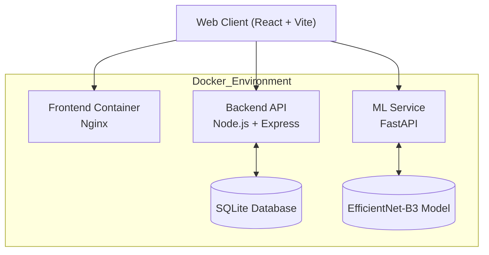

<p align="center">
  
</p>

<h1 align="center">🌾 ArdCenter</h1>

<p align="center">
  <strong>Smart Agritech Ecosystem Powered by Artificial Intelligence</strong>
</p>

<p align="center">
  Marketplace • AI Diagnosis • Expert Consultation • Smart Logistics
</p>

<p align="center">

  

  

  

  

  

</p>

<p align="center">

  

  

  

</p>

---

# 🌍 About ArdCenter

ArdCenter is an intelligent agritech platform designed to modernize agriculture in Morocco and Africa through artificial intelligence, digital commerce, and real-time expert assistance.

The platform combines:

- 🛒 Agricultural marketplace
- 🧠 AI-powered plant disease detection
- 🧑‍🌾 Expert agronomist consultation
- 🚚 Smart logistics & delivery management
- 📦 Dockerized production-ready infrastructure

---

# ✨ Core Features

## 🛒 Smart Agricultural Marketplace

- Purchase seeds, fertilizers, IoT sensors, and phytosanitary products
- Heavy equipment rental system
- Product categorization and filtering
- Real-time stock management

---

## 🧠 AI Plant Disease Detection

- Upload plant leaf images directly from mobile or desktop
- Deep learning image classification using EfficientNet-B3
- Instant disease prediction with confidence score
- Automatic treatment recommendation system

Supported crops:

- 🍅 Tomatoes
- 🫒 Olives

---

## 🧑‍🌾 Expert Consultation System

- Real-time messaging with agronomists
- Expert profiles by specialization
- Consultation history tracking
- Subscription and point management system

---

## 🚚 Smart Logistics

- Delivery management dashboard
- Driver assignment system
- Order tracking
- Logistics workflow optimization

---

# 📐 System Architecture



---

# 🧱 Tech Stack

| Layer | Technologies |
|---|---|
| Frontend | React 19, Vite, Context API |
| Backend | Node.js, Express |
| AI Service | FastAPI, PyTorch |
| Database | SQLite |
| Containerization | Docker & Docker Compose |
| Machine Learning | EfficientNet-B3 |
| Reverse Proxy | Nginx |

---

# 🚀 Quick Start

## 🐳 Docker Setup (Recommended)

### 1. Clone the repository

```bash
git clone https://github.com/ArdCenter/ardcenter-agritech.git
cd ardcenter-agritech
```

---

### 2. Start all services

```bash
docker compose up --build -d
```

---

### 3. Access the platform

| Service | URL |
|---|---|
| Frontend | http://localhost:5173 |
| Backend API | http://localhost:5000/api/health |
| FastAPI Docs | http://localhost:8000/docs |

---

### 4. Stop containers

```bash
docker compose down
```

---

# 🛠️ Local Development Setup

<details>
<summary>Click to expand manual installation guide</summary>

# Backend Setup

```bash
cd backend
npm install
npm start
```

Backend runs on:

```bash
http://localhost:5000
```

---

# ML Service Setup

```bash
cd ml-service

python -m venv venv
```

## Windows

```bash
venv\Scripts\activate
```

## Linux / macOS

```bash
source venv/bin/activate
```

Install dependencies:

```bash
pip install -r requirements.txt
```

Run FastAPI server:

```bash
python main.py
```

ML Service runs on:

```bash
http://localhost:8000
```

---

# Frontend Setup

```bash
cd market-place
npm install
npm run dev
```

Frontend runs on:

```bash
http://localhost:5173
```

</details>

---

# 🔌 API Overview

# ⚙️ Express Backend API

| Method | Endpoint | Description |
|---|---|---|
| GET | `/api/health` | API health check |
| GET | `/api/products` | Fetch marketplace products |
| GET | `/api/rentals` | Fetch rental equipment |
| POST | `/api/login` | User authentication |
| GET | `/api/expert-categories` | Expert specialization categories |
| POST | `/api/expert-consultations/start` | Start expert consultation |

---

# 🧠 FastAPI ML Service

| Method | Endpoint | Description |
|---|---|---|
| GET | `/` | ML API health check |
| POST | `/predict` | Plant disease classification |

---

# 🧪 AI Model Specifications

The AI diagnosis service uses a convolutional neural network based on:

## 🤖 EfficientNet-B3

Framework:

- PyTorch

Supported prediction classes:

| Crop | Disease |
|---|---|
| Olive | Peacock Spot |
| Olive | Aculus Olearius |
| Olive | Healthy |
| Tomato | Late Blight |
| Tomato | Spider Mite |
| Tomato | Healthy |

---

## 🎯 Confidence Threshold

If prediction confidence is below:

```text
40%
```

The user is prompted to upload a clearer image to improve prediction accuracy.

---

# 🔑 Test Accounts

| Role | Email | Password |
|---|---|---|
| 👑 Admin | admin@injaz.ma | admin |
| 🩺 Expert | expert.plantes@ardcenter.com | Expert123! |
| 🧑‍🌾 Farmer | user@ardcenter.com | user |

---

# 📁 Project Structure

```text
Marketplace/
│
├── backend/
│   ├── database.js
│   ├── server.js
│   ├── market.sqlite
│   └── Dockerfile
│
├── market-place/
│   ├── src/
│   ├── public/
│   ├── nginx.conf
│   └── Dockerfile
│
├── ml-service/
│   ├── main.py
│   ├── best_model.pth
│   └── Dockerfile
│
├── docker-compose.yml
│
└── README.md
```

---

# 🚀 Future Roadmap

- 📱 Mobile application
- 🌍 Multi-language support
- 🔔 Real-time notifications
- 🛰️ Satellite crop monitoring
- 🤖 AI chatbot assistant
- 💳 Payment gateway integration
- 📍 GPS delivery tracking
- 📊 Advanced analytics dashboard

---

# 🤝 Contributors

| Name | Role |
|---|---|
| ArdCenter Team | Full Stack Development |
| AI Team | Machine Learning & FastAPI |
| UI/UX Team | Frontend Experience |

---

# 📜 License

This project is licensed under the MIT License.

---

<p align="center">
  🌱 <strong>ArdCenter</strong> — Cultivating the Future with AI & Innovation.
</p>
